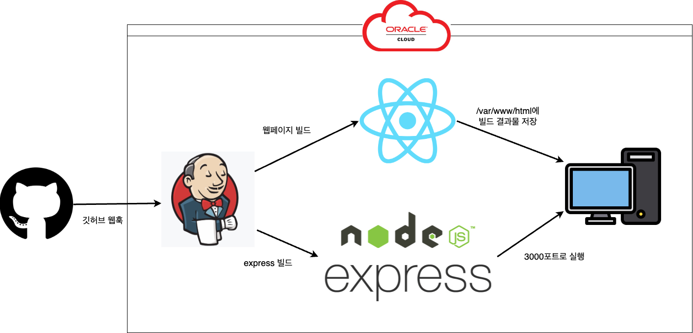

	

	<h3>📚 Tech Stack 📚</h3>
	
✨ Platforms & Languages ✨

    
	
	
	 
     
    
    
    
    
         
    
    
 
 
 

# ajou-only-five
친구들과 함께 To-do를 기록하고 공유하는 서비스입니다. 월별로 To-do 목록 완료 개수가 가장 많은 친구 5명의 정보를 차트로 보여줘, 친구들끼리 서로 To-do를 완료할 수 있도록 자극을 주고 받도록 구성했습니다.

## 시스템 설계도

    

## 배포 설계도

    

## 프로젝트 주요 기능

1. To-do 관리

+ To-do를 등록, 수정, 삭제할 수 있어요
+ To-do 공개 범위를 선택할 수 있어요

2. 친구 기능
+ 친구를 추가, 삭제할 수 있어요
+ 사용자를 검색할 수 있어요

3. 월별 To-do 랭킹 차트
+ 최대 5명까지 월별로 To-do 목록 완료 개수를 가장 많은 순으로 보여줘요

## 프로젝트 리포지토리
현재 레포는 프로젝트의 전체 개요를 설명하는 레포입니다.
 
프론트엔드 및 백엔드 레포를 열람하고 싶으시다면 아래 링크를 확인해주세요.
 

- AOF-Frontend: https://github.com/ajou-only-five/AOF-Frontend
- server: https://github.com/ajou-only-five/server

## 팀원 소개

|이름|역할|email|github|
|---|---|---|---|
|강동하|프론트엔드 개발|kmh0913@ajou.ac.kr|https://github.com/KNamuuu|
|나주영|백엔드 개발||https://github.com/orgs/ajou-only-five/people/NAJOO0|
|이균|프론트엔드 개발||https://github.com/gyunini|
|장성호|백엔드 개발 및 서비스 배포|qq9725@ajou.ac.kr|https://github.com/Long9725|